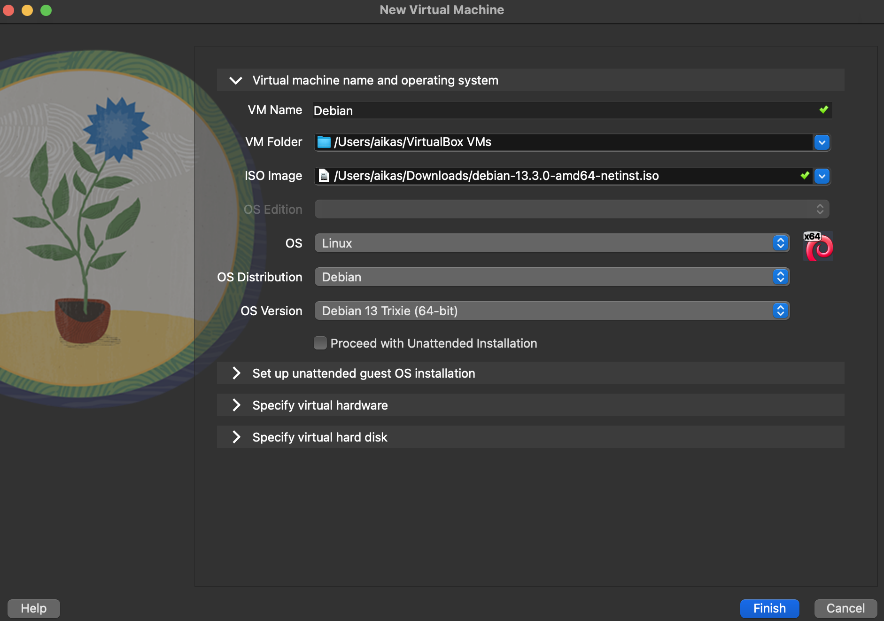
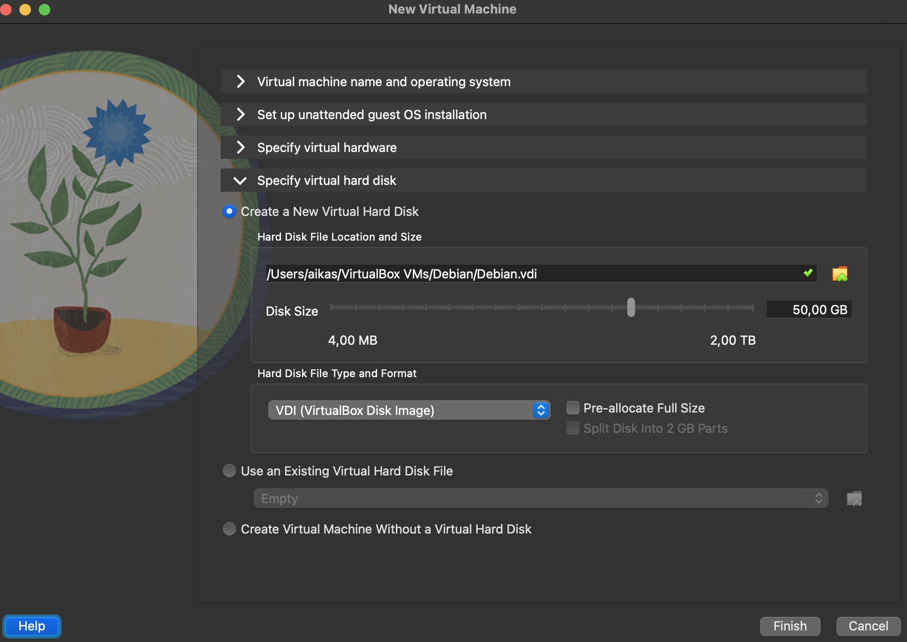
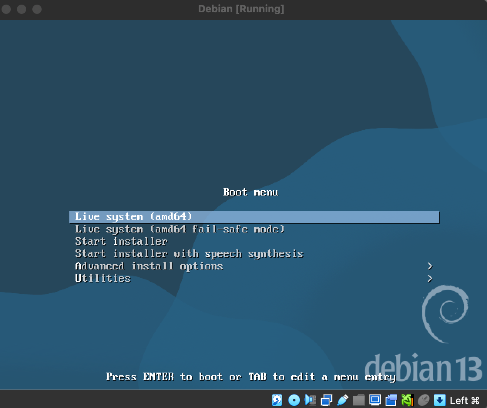
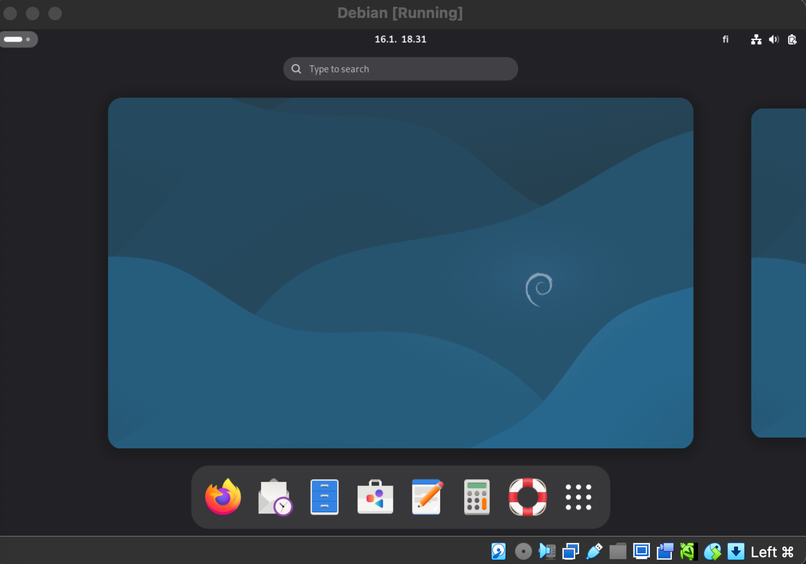

# Oman Linuxin asentaminen

Tämä on raportti on osa Linux palvelimet opintojakson h1-kotitehtävää. Tehtävänä on Linuxin (Debian 13 trixie) asentaminen omalle tietokoneelle Virtualboxin avulla ja harjoitella samalla raportointia. 

Käytössäni on 2018 Macbook Pro, jossa on Intel Core i5 prosessori (eli amd64 mallia) ja käyttöjärjestelmänä macOS Sequoia 15.7.2. Noudatin Tero Karvisen verkkosivuilta löytyvää ohjetta "Install Debian on Virtualbox - Updated 2024" koko prosessin ajan. 

#### Raportoinnista

Perustuen Tero Karvisen kirjoittamaan artikkeliin "Raportin kirjoittaminen", kun tietokoneella testataan jotain, se on aina hyvä raportoida. Aikaa säästyy kun suoritetut toimenpiteet ja lopputulokset on kirjattu ylös eikä niitä tarvitse turhaan toistaa. Testaaminen tai ongelman ratkominen helpottuu myös kun ajatukset on selkeytetty kirjallisena itselleen tai toiselle. 

Raportointissa kerrotaan täsmällisesti jokainen vaihe. Raportin on oltava toistettava niin, että joku muukin pystyisi suorittamaan samat asiat samoilla lopputuloksilla raportin perusteella. Myös ympäristö (tietokone, verkko, jne) on hyvä raportoida. Raportoinnin tulee myös olla täsmällistä: mitä tehtiin, mitä tapahtui, kauanko kesti, jne. Mitä tarkempaa raportti on, sitä helpompi on havaita mitä ei ole vielä kokeiltu. Jos raportissa on käyttty lähteitä, ne tulee tuoda ilmi. Raportin tulee lisäksi olla helppolukuista. Pilkkomalla tekstiä väliotsikoihin ja kirjoittamalla kieliopillisesti oikein sen lukeminen ja tulkitseminen helpottuu. 

Raportoinnissa ei saa plagioida tekstiä lähdettä ilmoittamatta tai toisen tuotosta esittää omanaan. Asioita ei myöskään saa keksiä päästään tai kysyä tekoälyltä, vaan väitetyt toiminnot tulee tehdä oikeasti. 

 
 
 

## Virtualboxin lataaminen

Aloitin lataamalla omaan käyttöympäristööni sopivan Virtualboxin (macOS / Intel hosts) osoitteesta https://www.virtualbox.org/wiki/Downloads, jonka jälkeen asensin sen koneelleni. 

 

## Debianin lataaminen

Latasin Linuxin, tässä tapauksessa Debian 13 trixien ISO-tiedoston osoitteesta
https://www.debian.org/CD/live/. Tein tässä kohtaan virheen, kun latasin Debianin ei-live version, mikä aiheutti ongelmia myöhemmin Debianin asennusvaiheessa. Alla olevassa on kuvassa on ylempänä väärä ja alempana oikea (live) lataus. Oikea paikka ladata tiedosto on siis https://www.debian.org/CD/live/.

 

### 1. Virtuaalikoneen luominen ja määrittäminen

Tarvittavat tiedostot ladattuani loin uuden virtuaalikoneen, johon voisin Linuxin asentaa. Navigoin Virtualboxissa "New", josta pääsin luomaan uuden virtuaalikoneen.

 

Määritin seuraavaksi virtuaalikoneen asetuksia: 
- nimi
- käyttöjärjestelmä (Debian 13 Trixie)
- lähimuisti (4GB)
- ytimien määrä (4)
- kovalevyn määrä (50GB) ja tyyppi (VDI).

 

 
 

### 3. Virtuaalikoneen käynnistäminen ja Debianin testaaminen

Kun määritykset oli tehty, käynnistin virtuaalikoneen. Tämä aukaisi Debianin bootmenun. Klikkasin Live system (amd64) ja muutaman kymmenen sekunnin lataamisen Debianin työpöytä aukesi. 

 
 

Kun Debian saatiin pyörimään, kokeilin hiiren, näppäimistön, näytön ja audion toimivuutta avaamalla Firefoxin ja vierailemalla Youtubessa. Kaikki todettiin toimivaksi. 

 

### 4. Debianin asentaminen

Vasemmasta alanurkasta löytyvästi ikonista klikkaamalla päästiin asentamaan Debiania. Ennen asentamista määritettiin: 
- kieli (American english)
- sijainti (Europe/Helsinki)
- näppäimistö (Finnish/Finnish(Macintosh)
- osiointi (Erase disk, ei enkryptata ja bootloaderin sijainti (Master Boot Record)
- käyttäjät (oma nimi & kirjautumistiedot)

Tämän jälkeen käynnistettiin asennus. Asennuksessa kesti 12 minuuttia. 

 

### 5. Käyttövalmis Linux

Asennuksen jälkeen käytössäni oli toimiva Linux käyttöjärjestelmä. 

### Lähteet: 

https://www.virtualbox.org/wiki/Downloads

https://www.debian.org/download

https://www.debian.org/CD/live/

https://terokarvinen.com/2021/install-debian-on-virtualbox/

https://terokarvinen.com/2006/raportin-kirjoittaminen-4/

https://terokarvinen.com/linux-palvelimet/

https://github.com/johannaheinonen/johanna-test-repo/blob/main/linux-20082025.md

