## h2_Komentaja Pingviini

Tekijä: Henri Äikäs
Kurssi: Linux Palvelimet ICI003AS2A-3016
Päivämäärä: 25.1.2016

### Command Line 
Tero Karvisen _Command Line basic revisited_ -artikkeli vuodelta 2020 kertoo, että jo ennen internetin syntyä käytössä ollut komentorivi on nopea ja käytännöllinen työkalu. 

Komentorivillä liikutaan aina hakemistoissa. Erilaisia komentoja ovat esimerkiksi _pwd, ls, cd, ja less._ Myös tiedostoja voidaan hallita komentorivillä esimerkiksi avaamalla editoreita (esim. _nano_, siirtämällä _mv_, kopioimalla _cp_ tai poistamalla _rm_. Tärkeitä hakemistoja ovat esimerkiksi root /, home (/home), home/user/, /etc/, /media/ ja (/var/log).

SSH etäyhteys saadaan muodostettua turvallisesti komentorivin avulla _ssh_ komennolla.

Tab-painikkeen ja nuolinäppäimien voimin pystytään käyttämään "automaattitäyttöä" tai tutkia komentorivin historiaa. 

Hallinnollisilla komennoilla (Adminisrative Commands) voidaan tehdä koko systeemiä koskevia toimintoja. Ne vaativat riittävästi oikeuksia, joita saadaan ajamalla _sudo_ komentoja, kuten _sudo apt-get update_.

Koen itse komentorivin nopeana työkaluna silloin, kun tiedän mitä olen tekemässä ja mitä komentoja tarvitsen. Komentoja on valtava määrä opeteltavaksi ja väärillä komennnoilla saatan aiheuttaa ongelmia itselleni. Tästä syystä sen opettelu on tärkeää ja mitä paremmin sen käytön osaa, sitä tehokkaampaa ja vähemmän riskialtista komentorivi surffailu on.

### Micro-editorin asentaminen

Asensin Micron komennolla _curl https://getmic.ro | bash_.

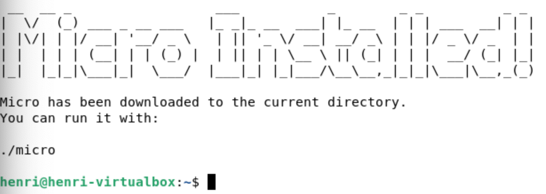

 
 

## Kolmen uuden komentoriviohjelman asentaminen

Kaikki kolme saatiin asennettua yhdellä komennolla: _sudo apt-get install htop tmux mc_. Terminaali pyysi käyttäjän salasanaa, jonka jälkeen se vielä varmisti, että 10,9 MB levytilaa otetaan käyttöön. Valintani olivat Tree, Tmux & Midnight Commander, joista kaikista alla lisää.

#### Tree

Hakemiston näyttäminen puuna. Tämä voi auttaa hahmottamaan kansioiden ja tiedostojen sisällöt. Jos halutaan näyttää vain tietyn kansion sisältö, voidaan lisätä komennon perään halutun kansion nimi. 

Käytetään _tree_ -komennolla. 

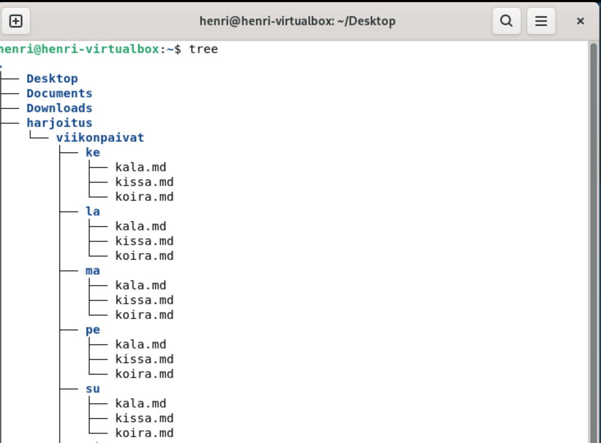

 

#### tmux
Terminaalin moniajo. Komennon avulla voidaan pitää useita terminaaleja auki yhdessä ikkunassa. tmux mahdollistaa, että terminaalit voidaan pilkkoa sessioihin ja paneeleihin, jotka jatkavat toimintaansa vaaikka terminaali suljettaisiin. Näin esimerkiksi SSH-yhteydet pysyvät hengissä estämällä katkeamisen vaikutukset. Saadaan käyttöön _tmux_ -komennolla.

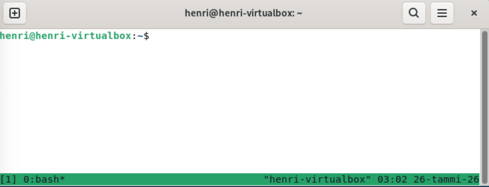

 

#### Midnight Commaander (mc)
Kaksipaneelinen tiedostonhallinta. Sen perusidea on kaksi rinnakkaista paneelia, joista toinen on lähdehakemisto ja toinen kohdehakemisto. Se mahdollistaa helposti tiedostojen siirtämisen paneelien välillä on aloittelijaystävällinen, sillä se tarjoaa graafista käyttöliittymää muistuttavan tavan hallita tiedostoja.

Paneelit saadaan käyttöön _mc_ -komennolla

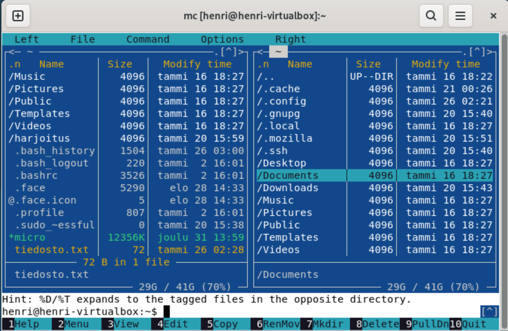

### Tärkeitä kansioita

/ -kansio on juurihakemisto (root). Se on kaikkien tiedostojenn alkupiste, jonka alta kaikki muu löytyy. 

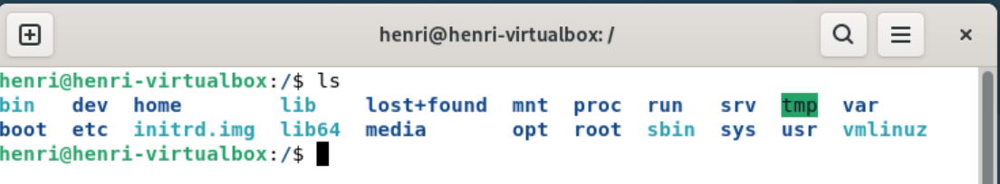

/home/
Käyttäjien kotihakemistoalue. Kaikkien tietokoneen yksittäisten käyttäjien omat hakemistot löytyvät täältä.

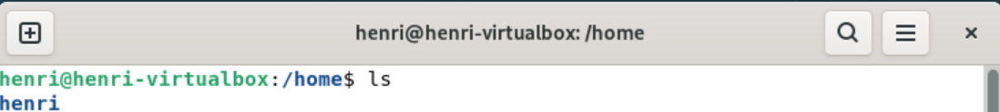

/home/user/

Yksittäisen käyttäjän kotihakemisto. Sisältää esimerkiksi käyttäjäkohtaiset tiedostot ja asetukset.

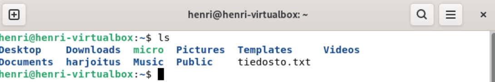

/etc/

Järjestelmän asetustiedostot. Muokkaus vaatii pääsääntöisesti sudo -oikeuksia.

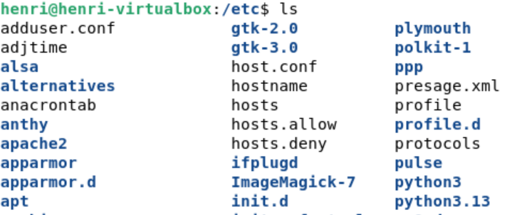

/media/

Tietokoneeseen liitetyt laitteet, kuten USB-tikut tai ulkoiset kovalevyt. Jos laite on liitettynä, kansiossa näkyy esimerkiksi /media/henri/USB_STICK. Kansio poistuu, kun laite irrotetaan. 

/var/log/

Näyttää lokitiedostot, eli järjestelmän tapahtumat. Hyödyllinen esimerkiksi vianetsinnässä, kun voidaann tarkastella mitä komentoja aiemmin on jo ajettu.

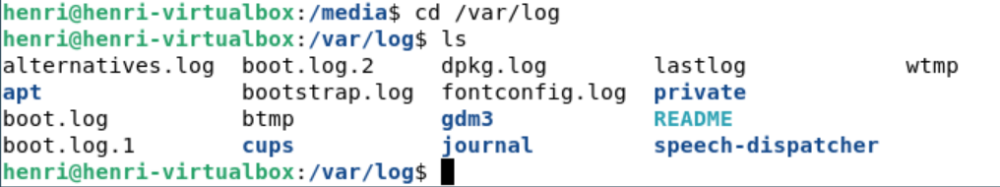

Kaikkiin kansioihin pääsee siirtymään helposti komennolla _cd kansio_, esimerkiksi cd/media/.

### Grep

grep -komennon avulla pystytään etsimään tekstiä tiedostoista. Perusmuodossaan se on _grep [vaihtoehdot] "hakusana" tiedosto_. Hakua pystytään muotoilemaan erilaisilla optioilla, kuten -i, jolloin haku ei välitä kirjainkoosta tai -v, jolloin etsitään vain rivit jotka eivät sisällä hakusanaa.

Kuvan esimerkissä etsitään tiedostosta "kotka" -tekstiä ja optio -c palauttaa rivien määrän, joilla etsitty merkkijono esiintyy.

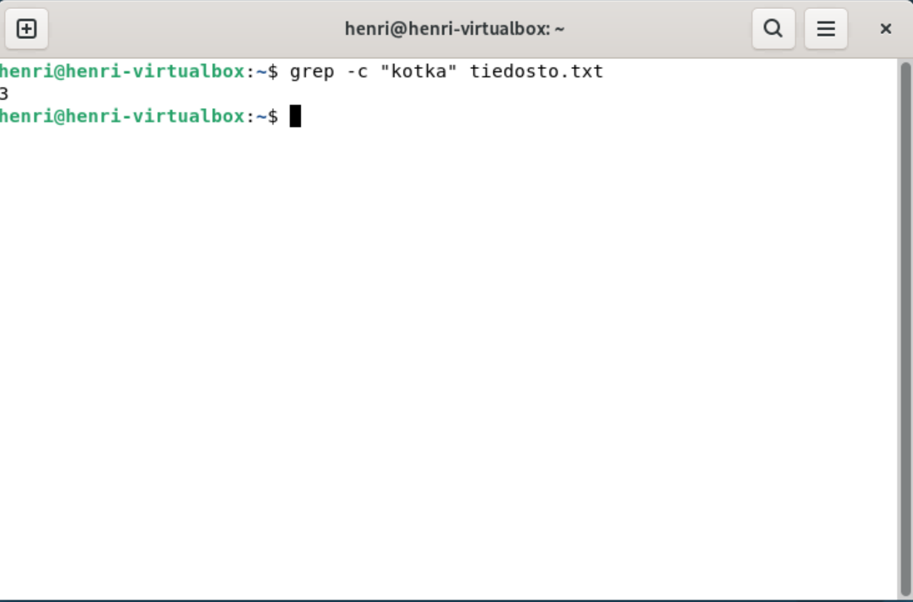

### Pipe

Putkilla on mahdollista yhdistää useita komentoja niin, että aiempi komento ketjuttuu seuraavaan. Komentorivillä putki merkataan | -merkillä.

Perusmuodossaan toiminto on siis _komento1 | komento2 | komento3_

Kyseisessä komennossa siis kirjoitetaan tiedostoon "tiedosto.txt", etsitään sieltä kaikki "koira" teksti ja korvataan kaikki "koira" teksti "kissalla". 

 

### Rauta

Aloitin koneen raudan testaamisen asentamalla lshw:n komennolla _sudo apt install lshw_. lshw tarkoittaa list hardware, eli se mmuodostaa laitteistoyhteenveto.

Komennolla _sudo lshw -short -sanitize_ tulostui yhteenveto, jossa -short optio tiivistää tiedot ja -sanitize poistaa sarjanumerot.

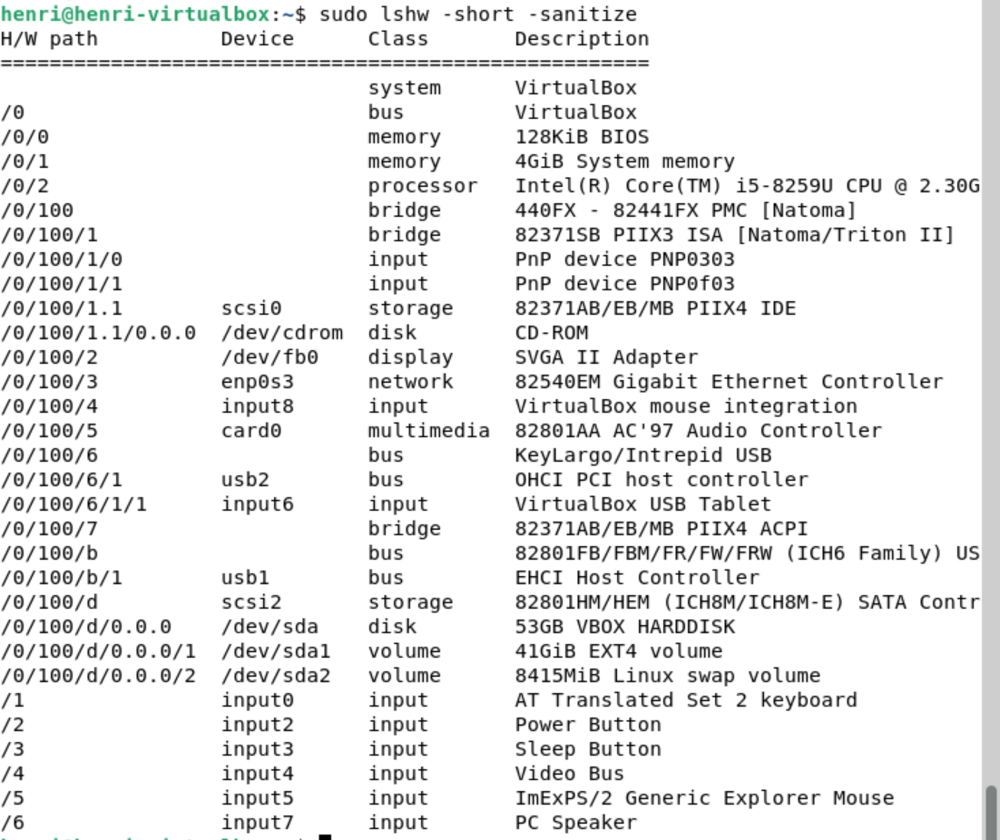

H/W path kertoo laitteen sijainnin laitepuussa, Device laitteen nimeen, Class luokan ja Description laitteen kuvauksen.

Yhteenvedosta selviää
  - Järjestelmä (VirtualBox)
  - Muisti (BIOS 4Gt RAM)
  - Suoritin (Intel Core i5)
  - Tallennustila (53Gt virtuaalinen kovalevy)
  - Näyttö (Virtualinen näytönohjaain SVGA II Adapter)
  - Verkko (Virtuaalinen verkkokortti)
  - Oheislaitteet (Hiiri ja muut USB-laitteet)
  - Ääni (Virtuaalinen äänikortti AC'97 Audio Controller)
  - Syöttölaitteet (Näppäimistö, virtapainike, Sleep-painike, kaiuttimet)

lshw -komento on hyödyllinen laitteiston tarkastamisessa. Sen avulla on helppo selvittää, millainen laitteisto testaaamisessa on käytössä. Vianetsinnässä voidaan tarkastella, aiheuttaako jokin mahdollisesti raudassa ongelmia ja se on myös hyödyllinen työkalu asioiden dokumentoinnissa, jotta saadaan tietoon millaisella alustalla toimitaan.

### Lähteet
Tehtävänanto h2_Komentaja_Pingviini. https://terokarvinen.com/linux-palvelimet/#h1-oma-linux. 
Karvinen, T. Command Line Basics Revisited artikkeli. https://terokarvinen.com/2020/command-line-basics-revisited/?fromSearch=command%20line%20basics%20revisited.
 
Piping in Unix and Linux. 2024. https://www.geeksforgeeks.org/linux-unix/piping-in-unix-or-linux/. 

Geradi, R. A beginnner's guide to tmux. 2022. https://www.redhat.com/en/blog/introduction-tmux-linux. 
Understanding Linux Directory Structure — A Beginner-Friendly Guide. Pinapatruni, K. 2025. 

https://medium.com/@kirann.bobby/understanding-linux-directory-structure-a-beginner-friendly-guide-9df45d460600. 
