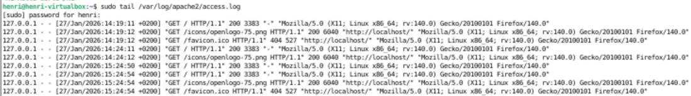
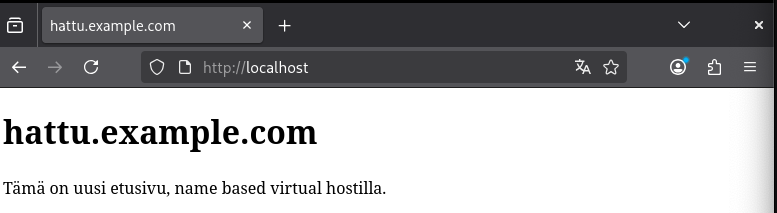
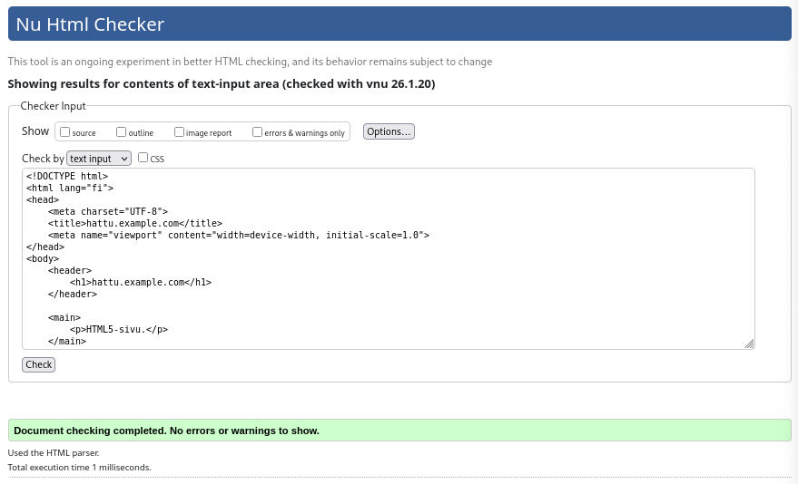
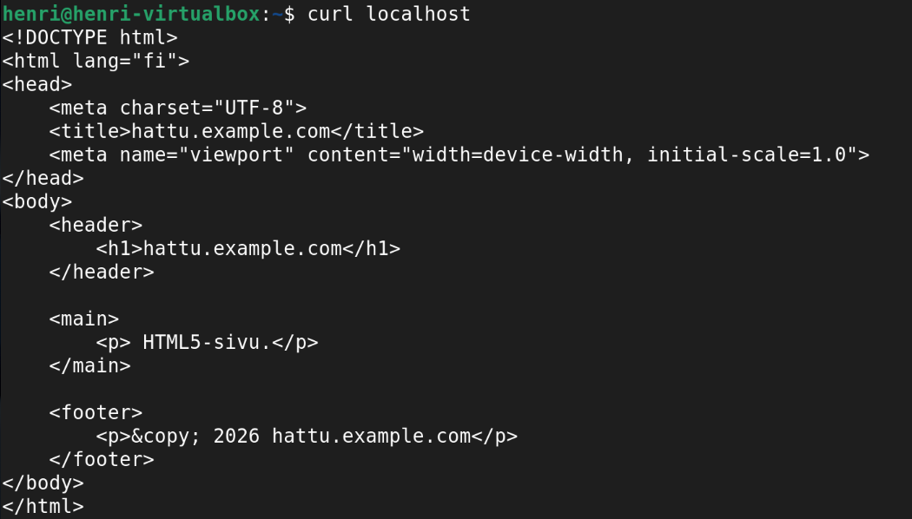
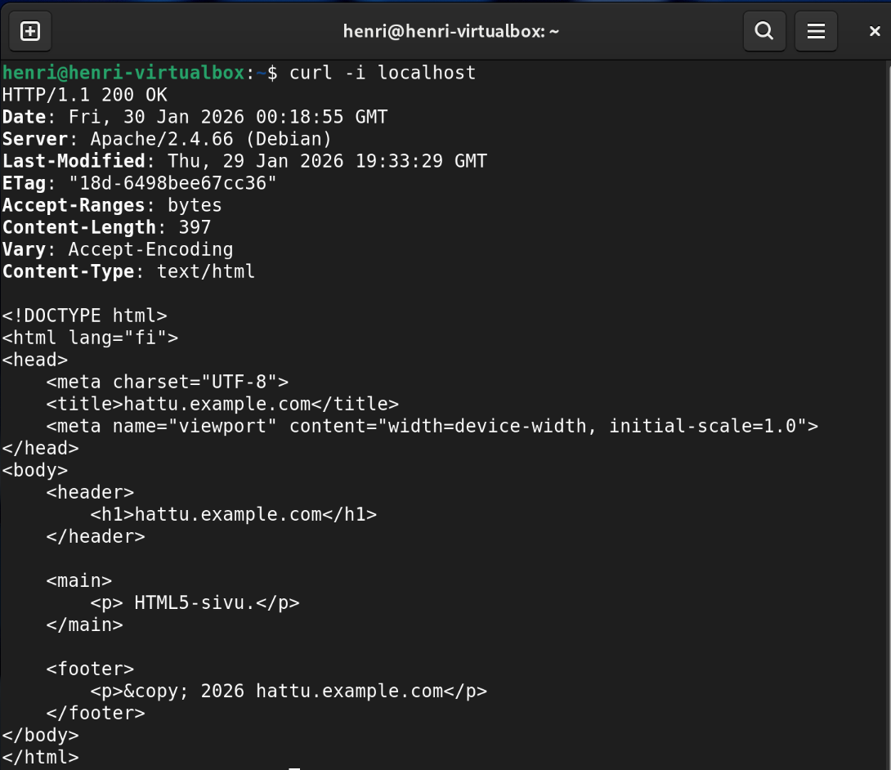

Opintojakso: Linux palvelimet ICI003AS2A-3016
Tekijä: Henri Äikäs
Alusta: Intel i5 Macbook Pro MacOs Sequaoia / Debian 13 trixie (VirtualBox)
Päivämäärä: 29.1.2025

## h3 Hello Web Server
x) Lue ja tiivistä (Muutama ranskalainen viiva kustakin artikkelista riittää. Tässä alakohdassa ei tarvitse tehdä testejä tietokoneella)
The Apache Software Foundation 2023: Apache HTTP Server Version 2.4 Documentation: Name-based Virtual Host Support
Karvinen 2018: Name Based Virtual Hosts on Apache – Multiple Websites to Single IP Address

Apache mahdollistaa useamman verkkotunnuksen käytön yhdellä IP-osoitteella.

    $ sudo apt-get -y install apache2
    $ echo "Default"|sudo tee /var/www/html/index.html

    

### Testaa, että weppipalvelimesi vastaa localhost-osoitteesta. Asenna Apache-weppipalvelin, jos se ei ole jo asennettuna.

Webbipalvelimen toimintaa testattiin komennolla

_curl http://localhost_

Komento tulosti tekstin, "Hello world" virheilmoituksen sijaan, joka tarkoitti, että webbipalvelin vastaa localhost-osoitteesta.

### Etsi lokista rivit, jotka syntyvät, kun lataat omalta palvelimeltasi yhden sivun. Analysoi rivit (eli selitä yksityiskohtaisesti jokainen kohta ja numero, etsi tarvittaessa lähteitä).

Lokit etsittiin komennolla

    sudo tail /var/log/apache2/access.log

Komento palautti kuvan mukaiset rivit:

###€ Etusivu uusiksi. Tee uusi name based virtual host. Sivun tulee näkyä suoraan palvelimen etusivulla http://localhost/. Sivua pitää pystyä muokkaamaan normaalina käyttäjänä, ilman sudoa. Tee uusi, laita vanhat pois päältä. Uusi sivu on hattu.example.com, ja tämän pitää näkyä: asetustiedoston nimessä, asetustiedoston ServerName-muuttujassa sekä etusivun sisällössä (esim title, h1 tai p).

Uuden name based virtual hostin luominen aloitettiin luomalla uusi DocumentRoot, jota käyttäjä voi muokata ilman root-oikeuksia. Sivulle luotiin oma hakemisto ja omistajuus normaalille käyttäjälle.

    sudo mkdir -p /var/www/hattu.example.com
    sudo chown -R $USER:$USER /var/www/hattu.example.com
    sudo chmod -R 755 /var/www/hattu.example.com

Seuraavaksi luotiin uusi etusivu, eli .html tiedosto. Tiedostoon kirjoitettin normaali HTML-sisältö. 

    nano /var/www/hattu.example.com/index.html

    <!DOCTYPE html>
    <html lang="fi">
    <head>
        <meta charset="UTF-8">
        <title>hattu.example.com</title>
    </head>
    <body>
        <h1>hattu.example.com</h1>
        
Tämä on uusi etusivu, name based virtual hostilla.

    </body>
    </html>

Luotiin uusi Virtual Host -asetustiedosto.

    sudo nano /etc/apache2/sites-available/hattu.example.com.conf

    <VirtualHost *:80>
    ServerName hattu.example.com
    ServerAlias localhost
    DocumentRoot /var/www/hattu.example.com

    <Directory /var/www/hattu.example.com>
        AllowOverride All
        Require all granted
    </Directory>

    ErrorLog ${APACHE_LOG_DIR}/hattu.example.com_error.log
    CustomLog ${APACHE_LOG_DIR}/hattu.example.com_access.log combined
    </VirtualHost>

Uusi sivu otettiin käyttöön komennolla

    sudo a2ensite hattu.example.com.conf
    sudo systemctl reload apache2

  Testattiin sivua vierailemalla http://localhost/ ja todettiin se tehtävänannon mukaiseksi. 

hattu.example.

## Tee validi HTML5 sivu. 

Varmistettiin, että sivu täyttää HTML5-vaatimukset, eli sivulta tuli löytyä.

  - `<!DOCTYPE html>`

  - `<html lang="fi>`

  - `<meta charset="UTF-8">`

  - Tarvittavat elememtit:
      - header, main, footer
  - Oikeat rakenteet:
      - head & body

Käytin HTML-sivun validointiin W3C Markup Validation Serviceä. Syötin sivulle hattu.examplen HTML-koodin ja se meni validaattorista läpi ilman virheitä. 

 
 

f) Anna esimerkit 'curl -I' ja 'curl' -komennoista. Selitä 'curl -I' muutamasta näyttämästä otsakkeesta (response header), mitä ne tarkoittavat.

curl -työkalu ottaa yhteyttä palvelimeenn ja vastaanottaa siltä dataa. curl ei renderöi webbisivuja vaan palauttaa niiltä raakadataa. Sen avulla voidaan esimerkiksi testata vastaako webbisivu, ladata tai lähettää tiedostaja tai debugata verkkoyhteyksiä. 

_curl_ -komento näyttää HTML-sivun sisällön komentorivillä. Esimerkiksi: 

        curl localhost

<brr>
 
 

 _curl  -i_ -komento näyttää sisällön lisäksi myös otsakkeet eli response headerit. 

         curl -i localhost

 

1. HTTP/1.1 200 OK
    - HTTP/1.1 on käytetty HTTP-versio
    - Statuskoodi 200 OK

2. Date: Fri, 30 Jan 2026 00:41:21 GMT

    - Milloin palvelin lähetti vastauksen

3. Server: Apache/2.4.66 (Debian)
   
    - Pyynnön käsittelemä ohjelmisto

5. Last-Modified: Thu, 29 Jan 2026 19:33:29 GMT

    - Milloin sivua on viimeksi muokattu

6. ETag: "18d-6498bee67cc36"

    - Tunniste resurssille versiohallintaa varten

7. Accept-Ranges: bytes

    - Ilmaisee, että palvelin tukee osittaisten latausten pyytämistä

8. Content-Length: 397

    - Vastauksen rungon koko tavuina

9. Vary: Accept-Encoding

    - Ilmaisee, että sisältö voi muuttua riippuen Accept-Encoding-otsakkeesta

Esim. palvelin voi palauttaa gzip-pakatun sisällön eri asiakkaille

9. Content-Type: text/html

    - Palautetun datan tyyppi. Tässä kohdassa siis text/HTML

m) Vapaaehtoinen, suosittelen tekemään: Hanki GitHub Education -paketti.

o) Vapaaehtoinen, vaikea: Laita sama tietokone vastaamaan kahdellla eri sivulla kahdesta eri nimestä. Eli kaksi weppisiteä samalla koneelle, esim. foo.example.com ja bar.example.com. Voit simuloida nimipalvelun toimintaa hosts-tiedoston avulla.

Lähteet:

The Apache Software Foundation 2023: Apache HTTP Server Version 2.4 Documentation: Name-based Virtual Host Support. https://httpd.apache.org/docs/2.4/vhosts/name-based.html

Karvinen, T 2018: Name Based Virtual Hosts on Apache – Multiple Websites to Single IP Address. https://terokarvinen.com/2018/04/10/name-based-virtual-hosts-on-apache-multiple-websites-to-single-ip-address/

