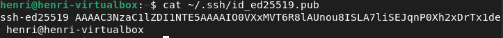
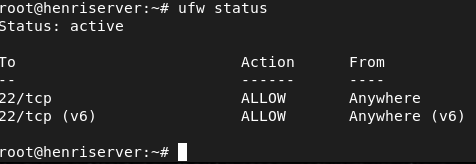
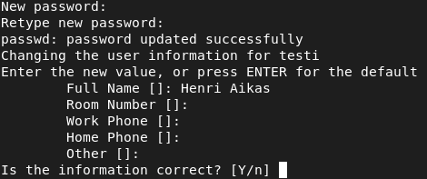
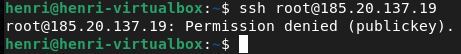

Kurssi: Linux palvelimet ICI003AS2A-3016

Tekijä: Henri Äikäs

Alusta: Intel i5 Macbook Pro MacOs Sequaoia 15.7.2 / Debian 13 trixie (VirtualBox)

Päivämäärä: 4.2.2025

 
 

Tämä raportti on osa Haaga-Helian Linux Palvelimet kurssia keväällä 2026.Tehtävänanto on h4 Maailma kuulee. Opettajana toimii Tero Karvinen. 

## h4 Maailma kuulee

### tiivistys
Luin Susanna Lehdon vuonna 2022 kirjoittaman "Teorista käytäntöön pilvipalvelimen avulla (h4)". Siinä Lehto vuokrasi käyttöönsä uuden pilvipalvelimen DigitalOceanissa. Käytän itse tässä dokumentaatiossa Upcloudin vastaavanlaista palvelua. Domain nimeä en itse vielä tässä vaiheessa hankkinut. Lehto kytkee palvelimelle palomuurin päälle, luo palvelimelle käyttäjän ja luo kotisivut. 

Tero Karvisen "First Steps on a New Virtual Private Server – an Example on DigitalOcean and Ubuntu 16.04 LTS" artikkelissa Karvinen on listannut lyhyesti ensiaskeleet uuden virtuaalipalvelimen ja DNS määrittelyyn. Käytän myöhemmin tässä raportissa samoja komentorivityökaluja kun mitä Karvinen on maininnut. Karvinen painottaa hyvien salasanojen käyttöä joka tilanteessa.

________________________________________________________________________________________________________________________________________________________________________________________

### Vuokraa oma virtuaalipalvelin haluamaltasi palveluntarjoajalta. (Vaihtoehtona voit käyttää ilmaista kokeilujaksoa, GitHub Education krediittejä; tai jos mikään muu ei onnistu, voit kokeilla ilmaiseksi vagrant:ia paikallisesti. Suosittelen kuitenkin harjoittelemaan oikeilla, tuotantoon kelpaavilla julkisilla palveluilla).

Päädyin hankkimaan oman virtuaalipalvelimen Upcloudilta. Loin palveluun käyttäjän, vahvistin sähköpostini ja lisäsin maksukorttitietoni. Sivusto ei veloita tililtä mitään, ennen kuin palveluja käytetään. 

Valitsin alimman tason, Helsingissä sijaitsevan palvelimen, jossa oli:
  - 1 prosessoriydin
  - 1Gt RAM-muistia
  - 10Gt Muistia
  - 3€ / kk hinta

Käyttöjärjestelmäksi valitsin Debian GNU/Linux 13 (trixie). Lisäsin palvelimelle luomani SSH-avaimen. Lopuksi vaihdoin vielä Server- ja Hostnamet itselleni sopiviksi. 

Julkisen SSH-avaimen olin luonut jo valmiiksi. Se luotiin komentorivillä ja saatiin kopioitua palvelimelle komennoilla:

    ssh-keygen
    cat ~/.ssh/id_rsa.pub

    
________________________________________________________________________________________________________________________________________________________________________________________

### Virtuaalipalvelimen ensiaskeleet

Uuden virtuaalipalvelimen määrittely aloitettiin kirjautumalla palvelimelle rootilla sisään. 

    ssh root@IP_osoite

Ajoin heti alkuun päivitykset. 

    sudo apt update

Seuraavaksi luotiin palomuuri. Yritin ajaa allaolevan komennon mutta sain virheilmoituksen, että ufw: command not found. 

    ufw allow22/tcp
    
UFW jouduttiin siis ensin asentamaan ja sen jälkeen kytkemään päälle. 

    apt install ufw -y
    ufw allow 22/tcp
    ufw enable -y
    ufw status
    

Tämä siis mahdollisti TCP-liikenteen portin 22 kautta. SSH käyttää oletuksenaan porttia 22. 

Tämän jälkeen luotiin palvelimelle uusi käyttäjä:

    adduser henri

Käyttäjälle määriteltiin salasana ja annettiin nimi. Muut tietokentät jätettiin tyhjäksi. 

Annoin kyseiselle käyttäjälle myös sudo -oikeudet, sillä olen sen pääsääntöinen käyttäjä. Jos käyttäjällä ei olisi tarvetta oikeuksille, ne jätettäisiin antamatta.

    sudo usermod -aG sudo,adm henri

Loin uuden käyttäjäkohtaisen .ssh-hakemiston. Määritin käyttäjälle oikeudet kansioon ja lisäsin _authorized_keys_ kansioon saman SSH-avaimen kun palvelimella. 

    mkdir -p /home/henri/.ssh
    chmod 700 /home/henri/.ssh
    chown henri:henri /home/henri/.ssh
    nano /home/henri/.ssh/authorized_keys

#### Kirjautumisongelma

Tämän jälkeen yritin kirjautua palvelimelle uudella henri -käyttäjällä. Tämä ei kuitenkaan toiminut, vaan sain "Permission denied (publickey). 

Aloitin ongelman selvittämisen tarkastamalla miltä SSH-palvelimen asetukset näyttävät. Sain avattua ne tarkasteluun komennolla

    nano /etc/ssh/sshd_config

Varmistin, että AuthorizedKeysFile on oikea, eli .ssh/authorized_keys. Tämän jälkeen varmistin, että käyttäjän .ssh -hakemisto on oikein ja siihen on riittävät oikeudet. 

    ls -ld /home/henri
    ls -ld /home/henri/.ssh
    ls -l /home/henri/.ssh/authorized_keys

Kokeilin vielä paikallisesti suorittaa debuggauksen

    ssh -v henri@IP-osoite

Debuggauksesta kävi ilmi, että SSH yritti tarjota kaikkia mahdollisia avaimia mutta serveri ei hyväksynyt niistä mitään. Tämä siis tarkoitti, että käyttäjän _authorized_keys_ oli todennäköisesti ongelmana. Vertasin palvelimelle lisättyä julkista SSH-avainta käyttäjän kansioon lisättyyn julkiseen SSH-avaimeen ja ne täsmäsivät. Ongelma ei siis ollut ainakaan se, että avaimet olisivat eri. Seuraavaksi koitin siis pakottaa oikeaksi todettua avainta:

    ssh -i ~/.ssh/id_ed25519.pub henri@IP-osoite

Sama ongelma jatkoi edelleen (permission denied). Yritin vielä useaan otteeseen varmistella, että käyttäjällä on oikeat oikeudet ja avaimet, palvelinasetukset ovat kohdallaan ja että komennot ovat oikein. Lopulta "luovutin" ongelman suhteen ja aloitin alusta. 

Loin kaiken alusta: laitoin uuden palvelimen pystyyn, loin uuden SSH-avaimen ja uuden henri -käyttäjän. Loppujen lopuksi pääsin uudella käyttäjällä sisään. En lopulta ollut täysin varma, mistä vika johtui. Jälkikäteen ajattelin, että vika saattoi jotenkin viallisesti rakennetuissa tai väärään paikkaan tallennettujen käyttäjäasetusten kanssa.

### Virtuaalipalvelimen määritys jatkuu

Kun uusi käyttäjä saatiin luotua, oli aika lukita root -käyttäjän kirjautuminen SSH:lla. Avasin palvelimen asetukset:

    sudo nano /etc/ssh/sshd_config

Configista etsittiin _PermitRootLogin_ yes --> no. Tallennettin ja käynnistettiin SSH uudelleen.

root-käyttäjän lukitus varmistettiin yrittämällä kirjautumalla palvelimelle root-käyttäjänä.

    ssh root@IP-osoite
    

________________________________________________________________________________________________________________________________________________________________________________________

### Weppipalvelin ja Name Based Virtual Host pystyyn

Asennettiin Apache

    sudo apt update
    sudo apt install apache2

Lyötiin palomuuriin reikä, jotta Apache toimii. Portti 80 on HTTP-protokollan oletusportti, joten tämä päästää HTTP-pyynnöt läpi.

    sudo ufw allow 80/tcp

Muokkasin HTML-sivua. Loin testisivusta varmuuskopion kopioimalla vanhan index.HTML -tiedoston. Loin myös backup tiedoston samalla.

    cd /var/www/html
    sudo mv index.html index.html.bak 

Muokkasin HTML-tiedostosta oikeaoppisen, eli varmistin, että tiedostossa on oikeaoppiset elementit.

    sudo nano index.html

________________________________________________________________________________________________________________________________________________________________________________________

Seuraavaksi luotiin uusi Name Based Virtual Host, jotta sivustoa voi hostata useampaa sivua samalla IP-osoitteella. Aluksi luotiin uusi hakemisto sivustolle.

Aloitettiin luomalla hakemisto uudelle sivustolle, johon sijoitetaan HTML, CSS, jne. 

    sudo mkdir -p /var/www/sauna41

Omistajaksi määriteltiin haluttu henri -käyttäjä. Näin käyttäjä kykenee muokkaamaan sivuja ilman sudo-oikeuksia. 

    sudo chown -R henri:henri /var/www/sauna41

Luodaan uusi HTML testisivu

    nano /var/www/sauna41/index.html

Conffataan uusi virtuaalihost Tässä siis määritellään mikä domain (ServerName) ohjaa mihin hakemistoon (DocumentRoot).

    sudo nano /etc/apache2/sites-available/sauna41.conf

ServerName määrittää siis nimen, jolla sivusto näkyy. Tässä tapauksessa siis sauna41.local
DocumentRoot määrittää hakemiston, missä HTML tiedostot sijaitsevat.

Aktivoidaan sivusto ja ladataan Apache uudelleen. 

    sudo a2ensite sauna41.conf
    sudo systemctl reload apache2

________________________________________________________________________________________________________________________________________________________________________________________

#### Lähteet:

Karvinen, T. Linux Palvelimet 2026 alkukevät online.  https://terokarvinen.com/linux-palvelimet/

Karvinen, T. 2017. First Steps on a New Virtual Private Server – an Example on DigitalOcean and Ubuntu 16.04 LTS. https://terokarvinen.com/2017/first-steps-on-a-new-virtual-private-server-an-example-on-digitalocean/

Lehto, J. 2022. Teoriasta käytäntöön pilvipalvelimen avulla (h4). https://susannalehto.fi/2022/teoriasta-kaytantoon-pilvipalvelimen-avulla-h4/

UpCloud-pavelu. https://upcloud.com/

