_Opintojakso: Linux palvelimet ICI003AS2A-3016_

_Tekijä: Henri Äikäs_

_Alusta: Intel i5 Macbook Pro MacOs Sequaoia 15.7.2 / Debian 13 trixie (VirtualBox)_

_Päivämäärä: 29.1.2025_

 
 

### Nimi. 

Aloitin hankkimalla webbisivulleni domain nimen Namecheapilta. Päädyin halpaan vaihtoehtoon ja valitsin domain nimeksi _sauna41.site_

Kun olin vuokrannut domain nimen Namecheapilta, navigoin Namecheapin Domain List -valikkoon. Lisäsin Advanced DNS -osuudessa serverin IP-osoitteen:

 - A record
 - @
 - IP-osoite
 - Automatic

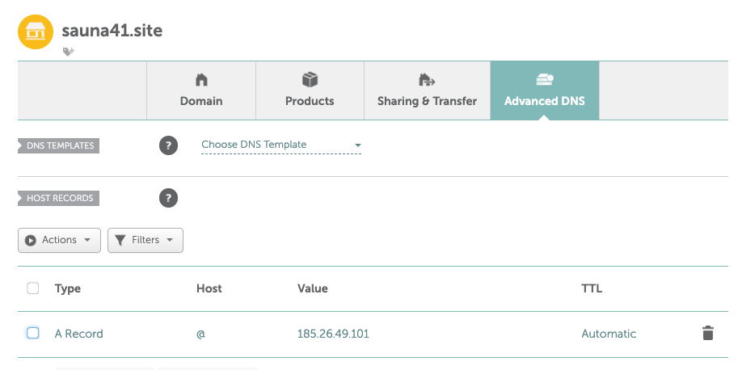

 
 

Tallensin asetukset ja tämän jälkeen webbisivullani oli toimiva nimipalvelu. 

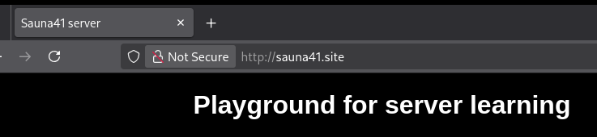

### Alidomain 

Tehtiin webbipalivemelle kaksi alidomainia: _linuxkurssi.sauna41.site_ & _wwww2.sauna.site_

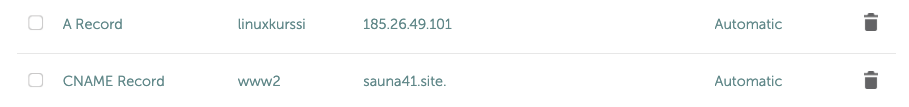

Alidomainit luotiin samanlailla kuin päädomain Namecheapissa. Toinen alidomain oli mallia A record (address record) ja toinen CNAME record (canonical name record).

A-record yhdistää domain nimen suoraan IPv4-osoitteeseen. CNAME record taas ohjaa toiseen domain-nimeen, josta taas noudetaan vastaava IP-osoite.

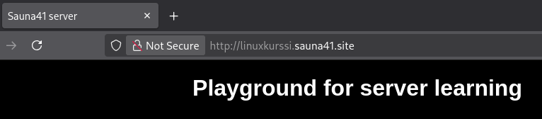

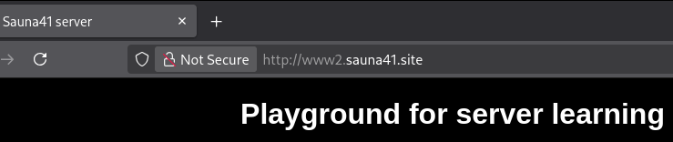

 

Nyt kummatkin alidomainit toimivat. 

 (Vapaaehtoinen bonus: Tee toinen alidomain A-tietueella ja toinen CNAME-tietueella. Vapaaehtoinen bonus: tee alidomainiin oma erillinen name based virtual host.)

### Host- ja dig-komennot 

dig -komentoa käytetään hakemaan DNS tietoa. Se on lyhenne **d**omain **i**nformation **g**roperista. Host -komento taas noutaa IP-osoitteen halutulta domainilta.

Asensin ensin DNS työkalut käyttööni komennoilla

    sudo apt update
    sudo apt install dnsutils

Tämän jälkeen kokeilin komentoja omaan webbisivuuni

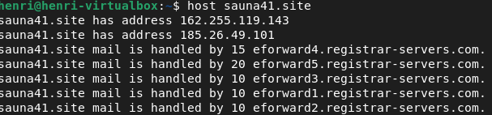

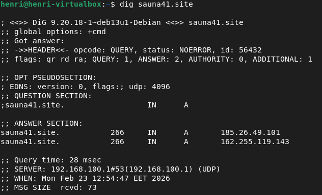

host -komento siis palauttaa sivuston IP-osoitteen. Se on hyvin yksinkertainen ja näyttää vain tuloksen.

dig -komento puolestaan on erittäin tarkka. Se palauttaa oletuksena HEADER, QUERY, ANSWER & AUTHORITY. Tiedot ovat huomattavasti tarkemmat, joten dig -komento soveltuu paremmin analyysiin. Omalla sivullani HEADER palauttaa status: NOERROR, mikä tarkoittaa, että DNS vastaa oikein. ANSWER taas palauttaa webbisivun IP-osoitteen. QUERY: 1, ANSWER: 2 taas kertoo, että sivulla on kaksi A-tietuetta.

Omilta sivuiltani dig -komennosta voidaan siis tulkita:

 - Kaksi A-tietuetta.
 - sauna41.site. 300 IN  A  tarkoittaa, että tutkittiiin A-tietuetta eli IPv4-osoitetta.
 - TTL-arvo, eli Time to Live (udp) on 521. Tämä tarkoittaa 521 sekuntia, eli aikaa, jolla DNS-tieto välimuistetaan ennen kuin se pitää hakea uudelleen. Lyhyt TTL mahdollistaa IP-osoitteiden vaihtamisen nopeasti.

Host -komennolla omalta webbisivulta saadaan seuraavaa:
 

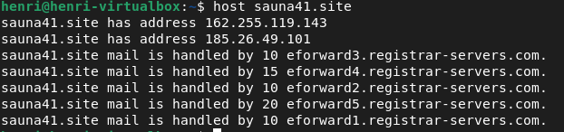

Voidaan kokeilla, onko sivustolla käytössä IPv6 komennolla

    dig AAAA sauna31.site

Sähköpostin (MX-tietue) määrityksen voi tarkistaa

    dig MX sauna41.site

 

Pienen toimijan (Atkins Ry) sivusto palauttaa hyvin samankaltaiset tiedot:

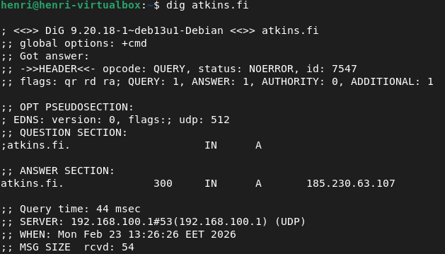

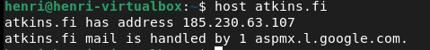

"atkins.fi mail is handled by 1 aspmx.google.com". Tämä tarkoittaa, että domainilla on MX-tietue, joka määrittää, mille palvelimelle sähköposti toimitetaan. Kyseisellä sivustolla sähköposti käsitellään Googlen palvelimella. Numero 1 kertoo, että se on prioriteettitietue. Tietueita voisi olla myös useampi, jolloin pienemmällä numerolla on aina korkein prioriteetti.

 

Suuren palvelun (Amazon.com) sivuja tutkiessa näkymä dig -komennolla on seuraava:

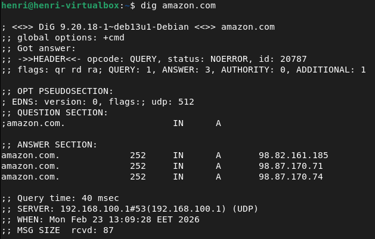

 - Kolme A-tietuetta, eli liikenne jaetaan kolmelle palvelimelle. Käytössä on siis kuormanjako (load balancing), mikä parantaa suorituskykyä.
 - amazon.com.  IN  A  tarkoittaa, että tutkittiiin A-tietuetta eli IPv4-osoitetta.
 - TTL-arvo on 252. Tämä tarkoittaa 252 sekuntia, eli aikaa, jolla DNS-tieto välimuistetaan. Lyhyt TTL mahdollistaa IP-osoitteiden vaihtamisen nopeasti.
 - SERVER: 192.168.100.1#53 on DNS-resolveri, ei Amazonin IP. Resolveri siis ohjaa kyselyn eteenpäin. IP-osoite saadaan tietoon dig NS amazon.com komennolla.

 

Host -komennolla taas saadaan seuraavaa:
   
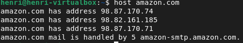

Komento kertoo, että "mail is handled by 5 amazon-smtp.amazon.com.", eli käytössä on MX-tietue.

 
 
 

**Lähteet:**

Karvinen, T. Linux Palvelimet. Luettavissa https://terokarvinen.com/linux-palvelimet/#h5-nimekas. Luettu 15.2.2026.

Namecheap sivusto. https://www.namecheap.com/

DnSupport. Differences Between A and CNAME Records. Luettavissa: https://support.dnsimple.com/articles/differences-a-cname-records/. Luettu 15.2.2026.

Zivanov, S. dig Command in Linux with Examples. PhoenixNAP. Luettavissa: https://phoenixnap.com/kb/linux-dig-command-examples. Luettu 15.2.2016.

Host command in Linux with examples. GeeksforGeeks. Luettavissa: https://www.geeksforgeeks.org/linux-unix/host-command-in-linux-with-examples/. Luettu 15.2.2026.
