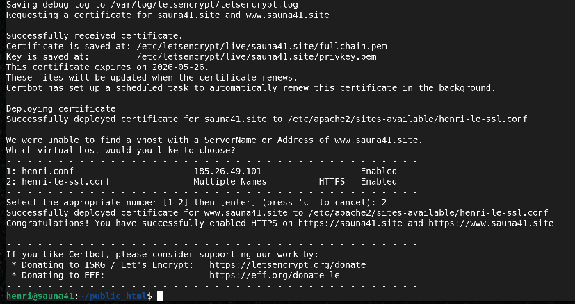
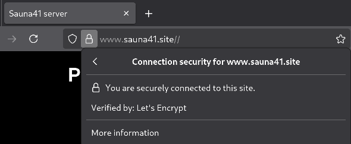
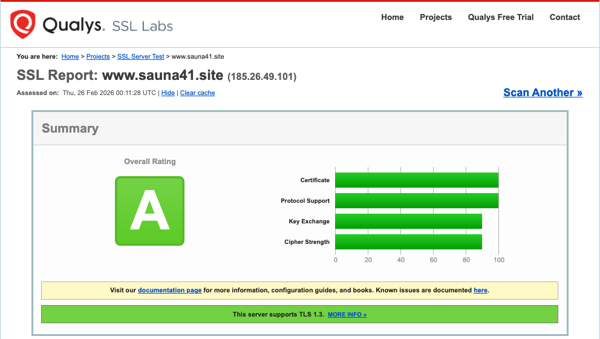

Kurssi: Linux palvelimet ICI003AS2A-3016

Tekijä: Henri Äikäs

Alusta: Intel i5 Macbook Pro MacOs Sequaoia 15.7.2 / Debian 13 trixie (VirtualBox)

Päivämäärä: 24.02.2026

_Tämä raportti on osa Haaga-Helian Linux Palvelimet kurssia keväällä 2026. Tehtävänanto on h6 Salataampa. Opettajana toimi Tero Karvinen._

________________________________________________________________________________________________________________________________________________________________________________________

x) Let’s Encrypt tarjoaa ilmaisen ja automatisoidun tavan hankkia HTTPS‑varmenteita eli sertifikaatteja ACME‑protokollan avulla. Sertifikaatit mahdollistavat HTTPS yhteyden ja salatun liikenteen. Sertifikaatti itsessään sisältää sivuston julkisen avaimen sekä tiedot sivuston omistajasta ja varmentajasta (Cloudflare.com).

Let's Encrypt luo uuden julkisen avaimen ja varmistaa domainin hallinnan esimerkiksi DNS‑tietueella tai HTTP‑tiedostolla. Tämän jälkeen asiakasohjelma voi pyytää, uusia ja perua varmenteita Let's Encryptilta. Uusiminen hoituu toistamalla sama prosessi tai se voidaan myös kytkeä uusiutumaan automaattisesti. (Let's Encrypt). Domainin validointi tehdään useammasta eri verkon näkökulmasta, jotta hyökkäykset estetään mahdollisimman tehokkaasti.

SSL konfiguraatiosta on löydyttävä **vähintään** seuraavat, jotta HTTPS yhteys toimisi eikä voisi muodostaa TLS-kättelyä. (Apache.org)

        LoadModule ssl_module modules/mod_ssl.so

        Listen 443
        <VirtualHost *:443>
            ServerName www.example.com
            SSLEngine on
            SSLCertificateFile "/path/to/www.example.com.cert"
            SSLCertificateKeyFile "/path/to/www.example.com.key"
        </VirtualHost>

________________________________________________________________________________________________________________________________________________________________________________________

### TLS-sertifikaatti Let's Encryptilta

Aloitin sertifikaatin hankkisimen kirjautumalla palvelimelleni 

    ssh henri@IP_osoite

Seuraavaksi asennettiin Certbot. Certbot on vapaan lähdekoodin työkalu, jolla voidaan hankkia Let's Encrypt -sertifikaatteja webbisivuille (Certbot.eff.org). Asentaminen toteutettiin komennoilla:

    sudo apt update
    sudo apt install certbot python3-certbot-apache

Tämän jälkeen hain ja asensin itse Let's Encrypt -sertifikaatin

    sudo certbot --apache -d sauna41.site -d www.sauna41.site

Komentoa seurasi Certbotinn kysely, jossa oli mahdolllista

- Antaa oma sähköposti-osoite Let's Encrypt ilmoituksia varten
- Käyttöehtojen hyväksyminen
- Haluanko ohjata HTTP --> HTTPS automaattisesti
- Halutun domainin valinta.
    
Sain ilmoituksen, että sivulle www.sauna41.site ei löydy vhostia. Piti valita kahden eri virtuaalihostin väliltä, jolloin valitsin vaihtoehdon 2 _(henri-le-ssl.conf  Multiple Names     HTTPS   Enabled)_

Tämän jälkeen sain ilmoituksen, että sertifikaatio onnistui sivuilleni www.sauna41.site ja sauna.site. 

________________________________________________________________________________________________________________________________________________________________________________________

### A-rating

Testasin oman sivuni TLS SSL Labsin laadunvarmistustyökalulla. Syötin webbisivun osoitteen ja tarkastuksen jälkeen sain A-ratingin, eli konfiguraatio täyttää lähes kaikki turvallisuusvaatimukset.

Koko sertifikaatti ja konffaus ovat luetttavissa linkeistä

_https://github.com/sauna41/linux-palvelimet/blob/main/kuvia/ssllabs1.png_

_https://github.com/sauna41/linux-palvelimet/blob/main/kuvia/ssllabs2.png_

________________________________________________________________________________________________________________________________________________________________________________________

Lähdeluettelo:

Karvinen T. Linux palvelimet kurssimateriaali. Luettavissa: https://terokarvinen.com/linux-palvelimet/. Luettu 24.2.2026.

What is SSL certificate. Cloudflare. Luettavissa: https://www.cloudflare.com/learning/ssl/what-is-an-ssl-certificate/. Luettu 24.2.2026.

About Certbot. Luettavissa: https://certbot.eff.org/pages/about. Luettu 24.2.2026.

SSL Labs. SSL Server Test. Luettavissa: https://www.ssllabs.com/ssltest/. Luettu 24.2.2026.

SSL/TLS Strong Encryption: How-To. Apache.org. Luettavissa: https://httpd.apache.org/docs/2.4/ssl/ssl_howto.html#configexample. Luettu 24.2.2026.

How It Works. Let's Encrypt. 2.8.2025 .Luettavissa: https://letsencrypt.org/how-it-works/. Luettu 24.2.2026.

