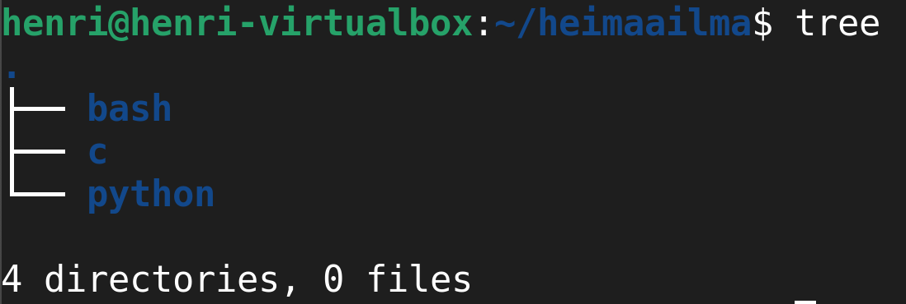
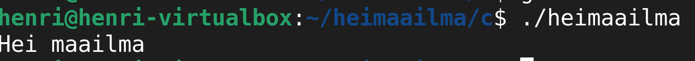
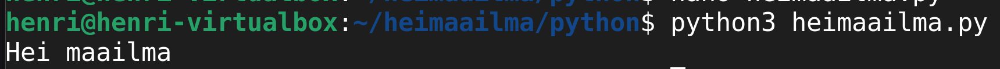
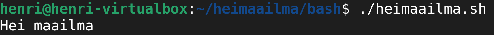
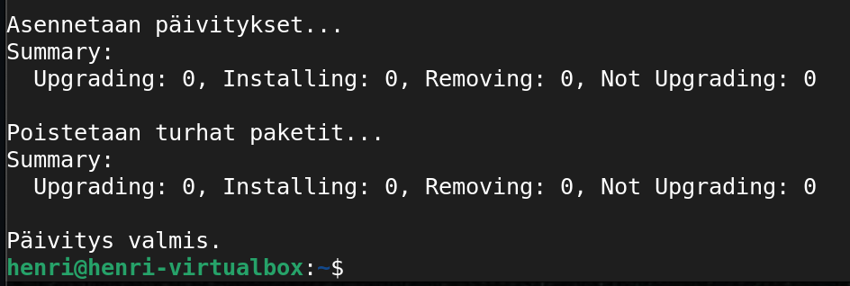
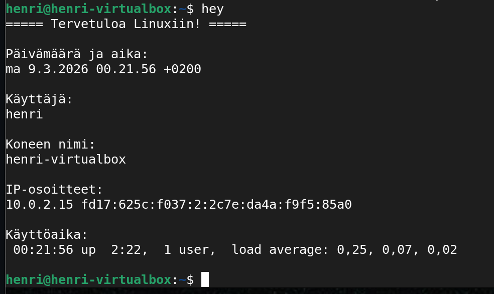
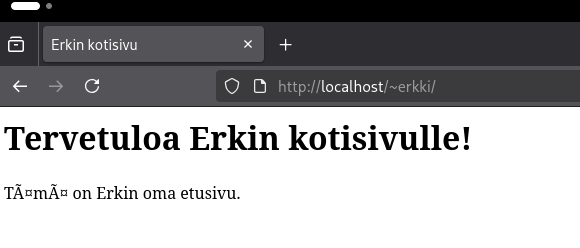
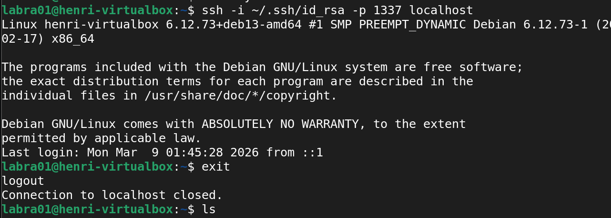
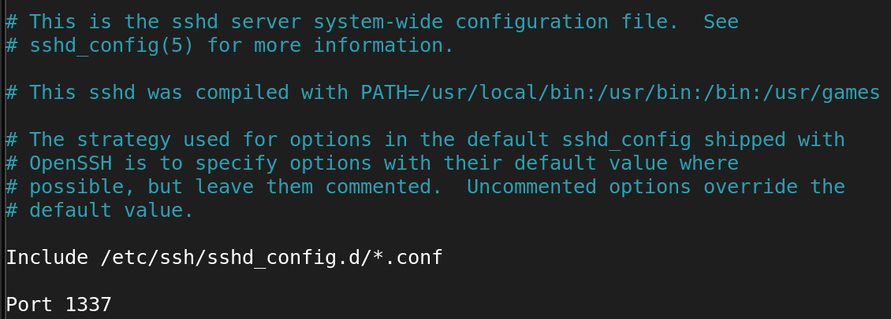

_Kurssi: Linux palvelimet ICI003AS2A-3016_

_Tekijä: Henri Äikäs_

_Alusta: Intel i5 Macbook Pro MacOs Sequaoia 15.7.2 / Debian 13 trixie (VirtualBox)_

_Päivämäärä: 4.3.2026_

 

_Tämä raportti on osa Haaga-Helian Linux Palvelimet kurssia keväällä 2026.Tehtävänanto on h4 Maailma kuulee. Opettajana toimii Tero Karvinen._

________________________________________________________________________________________________________________________________________________________________________________________

## h7 Maalisuora

a) "Hei maailma" kolmella eri ohjelmointikielellä

Loin toiminnoille omat hakemistot: 

Valitsin kieliksi C:n, Pythonin ja Bashin. 

#### C

Loin uuden .c -tiedoston

    nano heimaailma.c

Kirjoitin tiedostoon skriptin toiminnan.

    #include <stdio.h>
    int main() {
        printf("Hei maailma\n");
        return 0;
    }

Ohjelma täytyi kääntää, jotta se olisi ajettava

    gcc -o heimaailma heimaailma.c

- gcc toimii kääntäjänä
- o heimaailma luo suoritettavan tiedoston nimeltään heimaailma
- heimaailma.c toimii lähdekoodina

Ohjelma ajettiin ja se tulosti halutun tekstin

    ./heimaailma.c

### Python

Loin tiedoston ja lisäsin sinne tulostuksen

    nano heimaailma.py
    print("Hei maailma")
    

### Bash

Loin tiedoston ja lisäsin sinne tulostuksen

    nano heimaailma.sh
    #!/bin/bash
    echo "Hei maailma"

    chmod +x  heimaailma.sh

chmod, eli _change mode_ muuttaa oikeuksia. Lisäsin +x, eli suoritusoikeuden. Tämä mahdollistaa tiedoston ajamisen. 

Ajoin lopulta skriptin komennolla

    ./heimaailma.sh

________________________________________________________________________________________________________________________________________________________________________________________

## Oma skripti

Tehtävänä oli luoda uusi, itse tekemä komento, jota kaikki koneen käyttäjät voisivat hyödyntää. Komento sai olla vapaavalintainen. Linuxin aktiivinen päivittäminen on tärkeää ja se tulee tehtyä joka kerta kun konetta käyttää. Päätinkin siis luoda ohjelman, joka tarkistaa päivitykset, asentaa ne ja poistaa vanhat, turhat paketit kaikki kerralla.

Aloitin luomalla uuden tiedoston. Jotta komento olisi kaikille saatavilla, oli tärkeää luoda skripti oikeaan hakemistoon. Käytin /usr/local/bin -hakemistoa, jotta se se tulisi käyttöön kaikille käyttäjille.

        sudo nano /usr/local/bin/update

Kirjoitin tiedostoon päivitysten hakemisen, asentamisen ja turhuuksien poistamisen

        #!/bin/bash

        echo "Päivitetään pakettilista..."
        sudo apt update
        
        echo
        echo "Asennetaan päivitykset..."
        sudo apt upgrade -y
        
        echo
        echo "Poistetaan turhat paketit..."
        sudo apt autoremove -y
        
        echo
        echo "Päivitys valmis."

Skriptistä piti tämän jälkeen vielä tehdä suoritettava. Se tapahtui lisäämällä siihen käyttöikeudet komennolla

        sudo chmod +x /usr/local/bin/update

Nyt uusi komento oli käytettävissä

________________________________________________________________________________________________________________________________________________________________________________________

## Vanha laboratioharjoitus

Viimeisenä tehtävänä oli suorittaa kurssin aiempien toteuksien laboratioharjoitus. Tarkkaa harjoitusta ei ollut määritetty, joten Googlesta etsimällä löysin "Final Lab for Linux Palvelimet 2023" -harjoituksen. Harjoitus oli moniosainen, joista osa oli tältä kurssilta tuttua ja osa täysin uutta. Sovelsin harjoitusta niiltä osin, mitä tällä kurssilla ei oltu käsitelty.

**d) hey**

Tehtävänä oli luoda komento, jota kaikki käyttäjät voivat hyödyntää hyödyllisen informaation tulostamiseen. Tehtävä oli hyvin samankaltainen, kuin tässä raportissa aiemmin suoritettu "update" skriptin luonti.

Aloitin jälleen luomalla "hey" tiedoston kaikkien käyttäjien saatavilla olevaan hakemistoon

        sudo nano /usr/local/bin/hey
        

        #!/bin/bash

        echo "===== Tervetuloa Linuxiin! ====="
        echo
        
        echo "Päivämäärä ja aika:"
        date
        echo
        
        echo "Käyttäjä:"
        whoami
        echo
        
        echo "Koneen nimi:"
        hostname
        echo
        
        echo "IP-osoitteet:"
        hostname -I
        echo
        
        echo "Käyttöaika:"
        uptime
        echo

        sudo chmod +x /usr/local/bin/hey

Hey -skripti tulostaa käyttäjälle nyt päivämäärän ja ajan, käyttäjän, koneen nimen, IP-osoitteen ja koneen käyttöajan.

 
 

**e) 1000x nano**

Seuraavassa tehtävässä tuli asentaa micro editoriin jokin vapaavalintainen plugin. Tehtävänanto oli sama, kuin minkä olin suorittanut aiemmin kurssilla. Silloin asensin runit -pluginin, joka mahdollisti skriptin ajamisen suoraan tekstieditorista. Asennuksesta ja käytöstä voi lukea lisää toisesta raportista h8 bonus: [linkki raporttiin](https://github.com/sauna41/linux-palvelimet/blob/main/h8_bonus.md#h2-plugin-micro-editorille). 

**f) Staattisesti sinun**

Tarkoituksena oli luoda käyttäjä Erkki Esimerkki ja luoda hänelle apache2 webbisivulle etusivu näkyviin. Apache oli luonnollisesti jo valmiiksi asennettu ja käytössä, joten tehtävä aloitettiin sen sijaan Erkin luomisella, komennolla

        sudo adduser erkki

Erkille määritettiin salasana "Esimerkki123", jonka jälkeen käyttäjä oli valmiina. Jotta Apachen pääkonfiguraatioita ei tarvinnut muokata jokaiselle uudelle käyttäjälle, käytettiin userdir -työkalua. Tällöin Apache tietää, kenelle käyttäjälle localhost -osoite tulee ohjata.

        sudo a2enmod userdir
        sudo systemctl restart apache2

Erkille luotiin uusi public_html -hakemisto, jonne etusivun .html sijoitettiin. Erkki sai myös hakemistoon tarvittavat oikeudet. 

        sudo chown -R erkki:erkki /home/erkki/public_html
        sudo chmod 755 /home/erkki
        sudo chmod 755 /home/erkki/public_html

Nyt Erkin etusivu oli paikallisesti toiminnassa. Se testattiin vierailemalla osoitteessa _http://localhost/~erkki/_

**f) Salattua hallintaa**

Tehtävänanto oli asentaa SSH-palvelin, luoda uusi käyttäjä ja automatisoida SSH-kirjautuminen niin, ettei salasanaa tarvita. Kun yhteys oli saatu toimimaan, tuli vielä vaihtaa palvelin kuuntelemaan liikennettä portti 1337 kautta.

Aloitettiin asentamalla SSH-palvelin

        sudo apt install openssh-server

Loin uuden testikäyttäjän "labra01"

        sudo adduser labra01

Kirjaudun uudella käyttäjällä sisään ja generoin tälle SSH-avainparin

        sudo su - labra01

        ssh-keygen -t rsa -b 4096 -f ~/.ssh/id_rsa

Komento loi uuden julkisen ja yksityisen avaimen. Seuraavaksi sallittiin salaamaton SSH-kirjautuminen. 

        mkdir -p ~/.ssh
        cat ~/.ssh/id_rsa.pub >> ~/.ssh/authorized_keys
        chmod 700 ~/.ssh
        chmod 600 ~/.ssh/authorized_keys

Kokeiltiin kirjautumista

        ssh -i ~/.ssh/id_rsa localhost

 

Kirjautuminen onnistui, eikä salasanaa kyselty. Lopuksi vaihdettiin vielä SSH-palvelin kuuntelemaan porttia 1337 avaamalla sshd konfiguraatio

        sudo nano /etc/ssh/sshd_config

Konfiguraatiosta etsittin "#Port 22" ja se vaihdettiin "Port 1337"

 

**Tehtävät h & i**

Seuraavat kaksi tehtävää keskittyivät Django kehitysympäristöön. Djangoa ei käsitelty tämän kurssin aikana, joten en lähtenyt suorittamaan näitä kyseisiä tehtäviä. Perehdyin kuitenkin itsenäisesti Djangoon teoriassa. 

Django on Python pohjainen web-sovelluskehys, joka mahdollistaa verkkosovellusten nopean, turvallisen ja ylläpidettävän kehittämisen. Se tarjoaa erilaisia valmiita työkaluja, kuten käyttäjähallinnan, tietokantayhteyksiä ja hallintapaneelin kehittäjän käyttöön.(MDN Web Docs.)

Django hyödyntää MTV (Model, View, Template) mallia, jossa tietokannoissa olevaa data esitetään kehittäjän toivomalla tavalla (Model), käyttäjänäkymä on halutunlainen (View) ja tekstitiedosto (esim. HTML) määrittää verkkosivun rakenteen ja logiikan (Geeks For Geeks).

________________________________________________________________________________________________________________________________________________________________________________________

### Lähteet

Karvinen, T. Linux Palvelimet. Luettavissa https://terokarvinen.com/linux-palvelimet/#h5-nimekas. Luettu 4.3.2026.

Karvinen, T. Final Lab for Linux Palvelimet 2023. Luettavissa: https://terokarvinen.com/2023/linux-palvelimet-2023-arvioitava-laboratorioharjoitus/. Luettu 8.3.2026.

Django introduction. MDN Web Docs. Luettavissa: https://developer.mozilla.org/en-US/docs/Learn_web_development/Extensions/Server-side/Django/Introduction. Luettu 8.3.2026.

Django Tutorial. Geeks For Geeks. Luettavissa: https://www.geeksforgeeks.org/python/django-tutorial/. Luettu 8.3.2026. 
