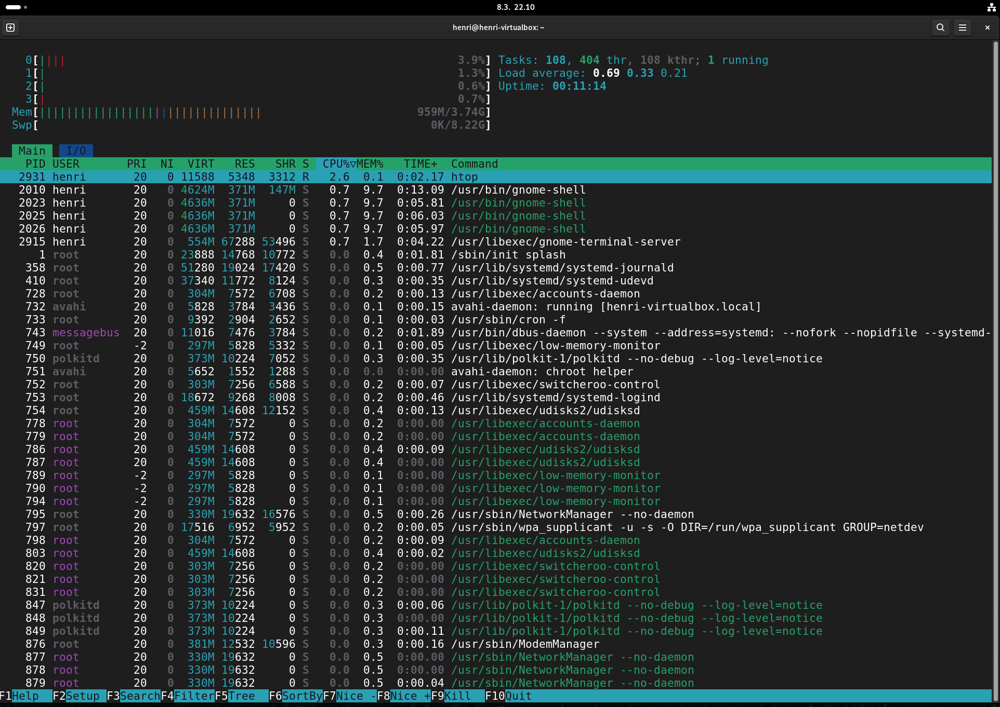
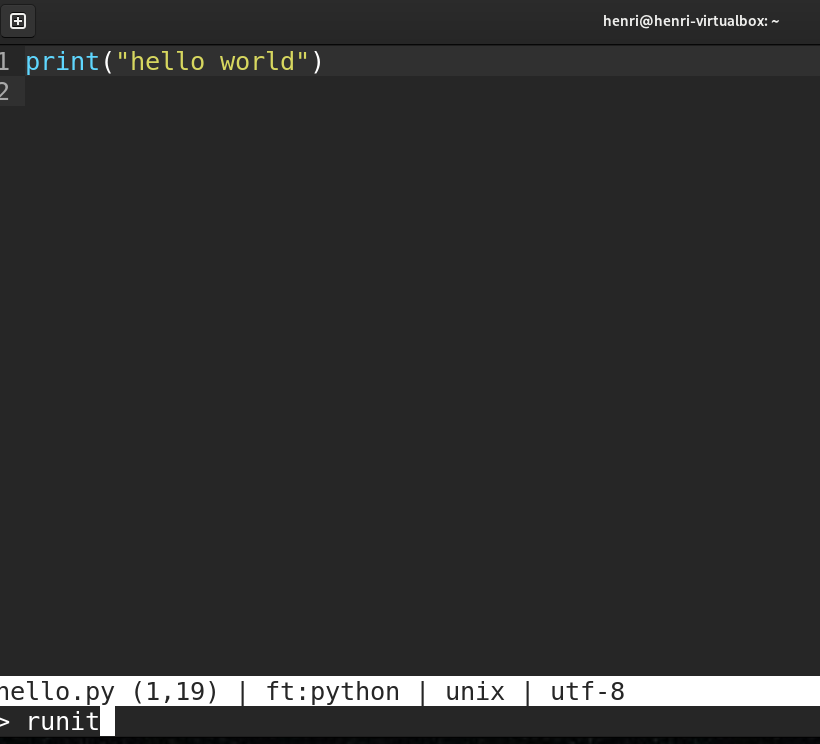
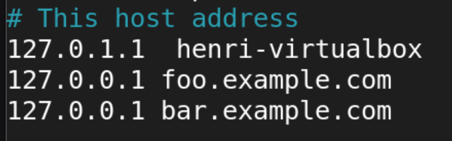
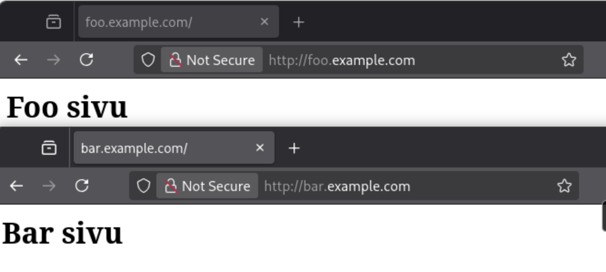
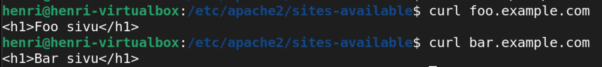

Kurssi: Linux palvelimet ICI003AS2A-3016

Tekijä: Henri Äikäs

Alusta: Intel i5 Macbook Pro MacOs Sequaoia 15.7.2 / Debian 13 trixie (VirtualBox)

Päivämäärä: 8.3.2026

_Tämä raportti on osa Haaga-Helian Linux Palvelimet kurssia keväällä 2026. Tehtävänanto on h8 bonus. Opettajana toimi Tero Karvinen._

________________________________________________________________________________________________________________________________________________________________________________________

Tässä raportissa on kurssin aikana suorittamani bonustehtävät. Tehtävät ovat olleet vapaaehtoisia lisätehtäviä aiempien harjoitusten yhteydessä ja ne on nyt raportoitu kootusti tänne.

## h1 Oma Linux: suosikkiohjelmani Linuxilla

Valitsin _htop_ komentoriviohjelman. htop näyttää kaikki käynnissä olevat prosessit reaaliaikaisesti. Sitä voidaan hyödyntää CPU:n ja RAMin tarkkailussa ja käynnissä olevia prosesseja voidaan järjestellä tai tappaa. 

htop -näkymässä näkymää tulkittuna:

- vasemmassa ylänurkassa numerot 0-3. Nämä ovat virtuaalikoneelle määritetyt 4 prosessoriydintä. Palkit näyttävät, kuinka paljon kukin ydin on käytössä.

- Muisti (Mem & Swp) kertovat, kuinka paljon muistia on käytössä ja vapaana.
- Oikealla näkyy

    Tasks: 108, 404 thr, 108 kthr; 1 running
    Load average: 0.69 0.33 0.21
    Uptime: 00:11:14

Numerot kertovat, että 108 prosessia on käynnissä, 404 threadia ja 1 prosessi aktiivisesti käynnissä. Load average kertoo järjestelmän kuormituksen 1, 5 ja 15 minuutin aikana. Uptime kertoo, kuinka kauan kone on ollut käynnissä.

- Suuri taulukko on prosessilista. Se kertoo prosessin tunnuksen, käyttäjän, CPU:n käytön, muistinkäytön ja käynnissä olevan ohjelman

- Alareunan F-komennoilla voidaan esimerkiksi etsiä tietty prosessi, järjestää prosessit CPU:n tai muistin mukaan tai lopettaa tietty prosessi.

________________________________________________________________________________________________________________________________________________________________________________________

## h2 Plugin micro-editorille

Latasin käyttööni runit -työkalun. Sen avulla voidaan suorittaa esimerkiksi Python, C- tai Java-ohjelma yhdellä komennolla suoraan tekstieditorista.

    micro -plugin install runit

Loin uuden Python-tiedosto ja kirjoitin sinne tulostuksen.

    micro hello.py
    print("hello world")

Ctrl + E saatiin auki Micro:n komentorivi. Kirjoittamalla komentoriville runit, plugin ajaa Python ohjelman suoraan tekstieditorista komentoriville.

________________________________________________________________________________________________________________________________________________________________________________________

## h3 Hello Web Server

Tehtävässä tuli laittaa sama tietokone vastaamaan kahdellla eri sivulla, kahdesta eri nimestä.

Ensimmäiseksi lLuotiin kummallekin sivulle omat hakemistot ja testisivut. Näin saatiin käytöön kaksi eri sivua, joissa oli eri sisältö.

        # hakemistot
        sudo mkdir -p /var/wwww/foo
        sudo mkdir -p /var/www/bar

        # testisivut<
        echo "<h1>Foo</h1 | sudo tee /var/www/foo/index.html
        echo "<h1>Bar</h1> | sudo tee /var/www/bar/index.html

Seuraavaksi luotiin VirtualHosti määrtykset kummallekin sivulle. Siirryttiin Apachen sites-available kansioon ja lisättin sinne Virtual Host asetukset. 

        sudo nano foo.conf
        sudo nano bar.conf
        # Kummallekin samanlaiset asetukset

Kun määritykset oli saatu valmiiksi, otettiin sivut käyttöön ja käynnistettiin Apache uudelleen.

        sudo a2ensite foo.conf
        sudo a2ensite bar.conf
        sudo systemctl reload apache2

Nyt kun sivut olivat pystyssä, täytyi nimet ohjata vielä samaan osoitteeseen. Tehtävssä ei käytetty oikeaa DNS palvelinta, joten ohjaus toteutettiin /etc/hosts -tiedostossa. Näin molemmat nimet saatiin osoittamaan samaan localhostiin. 

        sudo nano /etc/hosts

        # Lisättiin 
        127.0.0.1 foo.example.com
        127.0.0.1 bar.example.com

Nyt toteutusta voitiin kokeilla selaimessa. 

Eli nyt host-tiedosto ohjaa domain  nimen samaan IP-osoitteeseen, Apachen VirtualHost tarkistaa domain-nimen ja Apache valitsee oikean rootkansion. Lopuksi palvelin sivun. 

